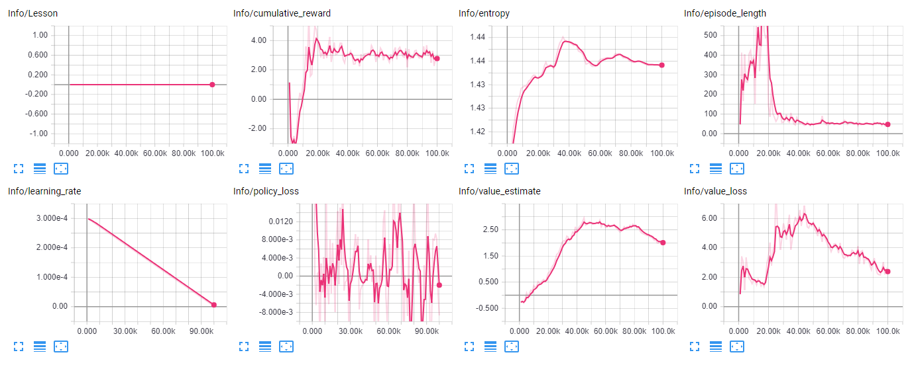
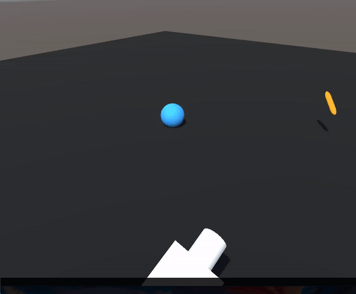

# Unity-MLFetch
A small ML-Agents project to become familiar with the basics of machine learning in Unity, based on the ML-Agents 0.3 beta.

This project was a small experiment of mine, aiming to create a lean ML enviroment where an agent can chase a target, and return to its starting position. In essence the model is trained to fetch. 

This project includes the Unity Enviroment only! To get access to the full Unity ML Agents for training models and setting up observations, see Unity's repo [here](https://github.com/Unity-Technologies/ml-agents).

The model was trained using through a reinforcement learning technique called Proximal Policy Optimization, and the details of this technique's implementation in Unity can be found [here](https://github.com/Unity-Technologies/ml-agents/blob/master/docs/Training-PPO.md).

The results of the training using the MLFetchTrain scene are summarized below using Tensorboard

A demo gif of the project can be seen below, fetching the thrown "stick"

